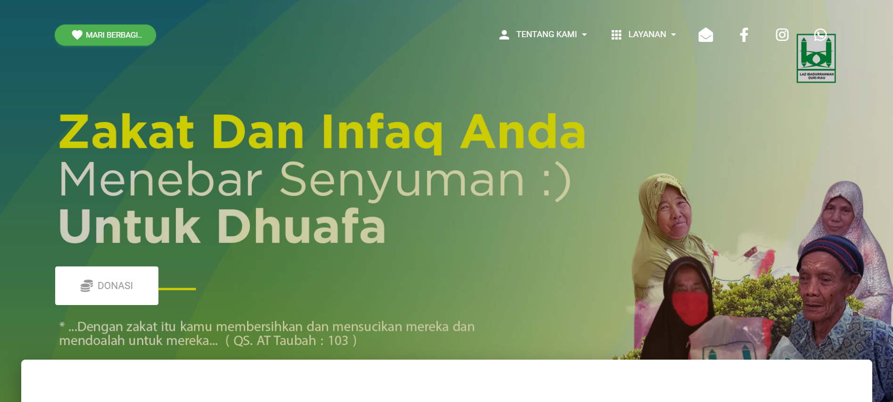
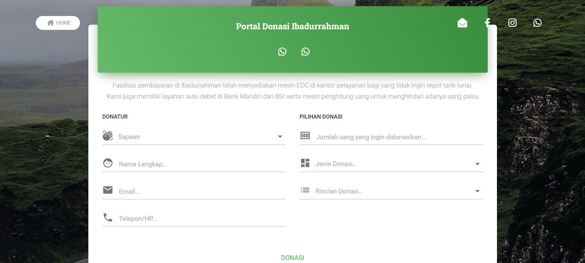
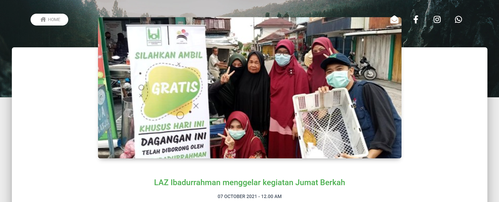

# [Official Website LAZ Ibadurrahman](https://laz.ibadurrahman.org/#/)

## Template by [Vue Material KIT](https://www.creative-tim.com/product/vue-material-kit)

 [](https://github.com/creativetimofficial/vue-material-kit/issues?q=is%3Aopen+is%3Aissue) [](https://github.com/creativetimofficial/vue-material-kit/issues?q=is%3Aissue+is%3Aclosed) [](https://discord.gg/E4aHAQy)



Ibadurrahman adalah lembaga zakat (LAZ atau Lembaga Amil Zakat) dan wakaf (LNW atau Lembaga Nazhir Wakaf) di Duri, Mandau, Kab. Bengkalis, Riau. Untuk berkontribusi dalam pengembangan website dapat melalui repository ini dan bisa menghubungi Fajrul sebagai developer utama nya..

> Contact Person:<br>
> [](https://wa.me/+6289637824843)
[](mailto:fajrulhaqqi50@gmail.com)


## Table of Contents

- [LAZ [](https://twitter.com/home?status=Vue%20Material%20Kit%20-%20Material%20Design%20UI%20Kit%20for%20Vue.js%20https%3A//www.creative-tim.com/product/vue-material-kit%20%23vuejs%20%23ui%20%23kit%20%23vuematerial%20%40creativetim)](#laz-)
  - [Table of Contents](#table-of-contents)
  - [Demo](#demo)
  - [Quick start](#quick-start)
    - [Tutorial Menambah Article](#tutorial-menambah-artikel)
  - [File Structure](#file-structure)
  - [Browser Support](#browser-support)

## Demo

| Landing Page | Donation Page | Articles Page  |
| --- | --- | ---  |
| [](https://demos.creative-tim.com/vue-material-kit/#/login)  | [](https://demos.creative-tim.com/vue-material-kit//landing)  | [](https://demos.creative-tim.com/vue-material-kit/#/profile)


## Quick start

Cara berkontribusi:

- Minta akses github direpo ini
- Clone Repository* - `git clone https://github.com/FajrulHQ/ibadurrahman.git` 
- Make new branch* - `git branch -d <nama branch baru>`
- Silahkan lakukan perbaikan atau pengembangan
- Kalau sudah sesuai dan tidak ada error build dist - `npm run build`
- Tambahkan perubahan (pastikan tidak merusak file krusial) - `git add .` 
- Buat keterangan hasil perubahan - `git commit -m "<keterangan>"`
- Push hasil nya ke github lalu pull request di repository - `git push -u origin <branch>`

  <small>*hanya untuk diawal saja, selanjutnya dapat dilewatkan dan gunakan branch yang telah dibuat</small>

### Tutorial menambah artikel
1. Akses data json dan masukin file img di 
   ```
   ibadurrahman/
   ├── src
   │   ├── assets
   │        └── img
   │             └── articles (folder untuk upload img)
   │    .
   │    .
   │   └── static
   │        └── article.json (file data article)
    ```
2. Data terdiri dari rincian berikut.

    | key           | type      | desc                          |
    |---------------| ----------|-----------------------------  |
    | `id`          | `int`     |urutan teratas yang terbesar   |
    | `type`        | `str`     |LAZ atau LNW                   |
    | `date`        | `datetime`|format: MM-DD-YYYY hh:mm:ss    |
    | `img`         | `str`     |nama file image                |
    | `link`        | `str`     |router ke artikel              |
    | `title`       | `str`     |judul artikel                  |
    | `highlight`   | `str`     |ringkasan artikel              |
    | `author`      | `str`     |nama penulis artikel           |
    | `content`     | `str`     |isi konten                     |


contoh:
```json

  {
    "id": 1,
    "type": "LAZ",
    "date": "07-11-2021 00:00:00",
    "img": "launching-beasiswa-tahfidz.jpg",
    "link": "launching-beasiswa-tahfidz",
    "title": "ALHAMDULILLAH ALLAHU AKBAR LAUNCHING BEASISWA TAHFIDZ SENILAI RP 600 JUTA UNTUK 20 MAHASANTRI PPTQ BELADING ",
    "highlight": "Program beasiswa Tahfidz ini setiap tahun kita berikan kepada para santri baru senilai Rp.600 juta/ Tahun",
    "author": "Andri",
    "content": "Program beasiswa Tahfiz ini setiap tahun kita berikan kepada para santri baru senilai Rp.600 juta/ Tahun yang dipilih untuk masuk Pptq Terpadu Ibadurrahman Belading, Dimana sebanyak 20 orang ini sebelumnya sudah diseleksi, baik yang mendaftar maupun yang kita cari. Jadi mereka berasal dari beberapa kecamatan seperti Mandau, Bathin Solapan, Rupat dan lainnya. Dan alhamdulillah pada kesempatan yang sama LAZ Ibadurrahman juga melepas 8 orang Da'i lulusan Pptq Terpadu Ibadurrahman Belading yang telah menyelesaikan pendidikan selama 2 tahun, untuk ditempatkan di desa-desa terpencil di Kabupaten Bengkalis. Insyaallah Laz Ibadurrahman akan menempatkan para Da'i sesuai dengan kebutuhan dan permintaan dari desa-desa bersangkutan( Serai Wangi, Bengkalis, Rupat, Bathin Solapan dan Sungai Pakning.) Semoga da'i da'i memberikan pengabdian terbaiknya ke masyarakat lingkungan mereka di tempat. Menjadi penerang jalan keimanan bagi umat."
  }
```

## File Structure

Within the download you'll find the following directories and files:

```
ibadurrahman/

├── CHANGELOG.md
├── README.md
├── babel.config.js
├── package.json
├── dist
├── public
│   └── index.html
├── src
│   ├── App.vue
│   ├── assets
│   │   ├── img
│   │   └── scss
│   │       ├── material-kit
│   │       └── material-kit.scss
│   ├── components
│   │   ├── Badge.vue
│   │   ├── Dropdown.vue
│   │   ├── Modal.vue
│   │   ├── Pagination.vue
│   │   ├── Parallax.vue
│   │   ├── Slider.vue
│   │   ├── Tabs.vue
│   │   ├── cards
│   │   │   ├── LoginCard.vue
│   │   │   └── NavTabsCard.vue
│   │   ├── tables
│   │   │   ├── SimpleTable.vue
│   │   │   └── TablePagination.vue
│   │   └── index.js
│   ├── layout
│   │   ├── MainFooter.vue
│   │   ├── MainNavbar.vue
│   │   └── MobileMenu.vue
│   ├── main.js
│   ├── plugins
│   │   ├── globalComponents.js
│   │   ├── globalDirectives.js
│   │   ├── globalMixins.js
│   │   └── material-kit.js
│   └── static
│       ├── article.json
│       ├── program.json
│   ├── router.js
│   └── views
│       ├── Landing.vue
│       ├── Donasi.vue
│       ├── Landing.vue
│       └── components
│           ├── NavPillsSection.vue
└── vue.config.js

```

## Browser Support

At present, we officially aim to support the last two versions of the following browsers:

    